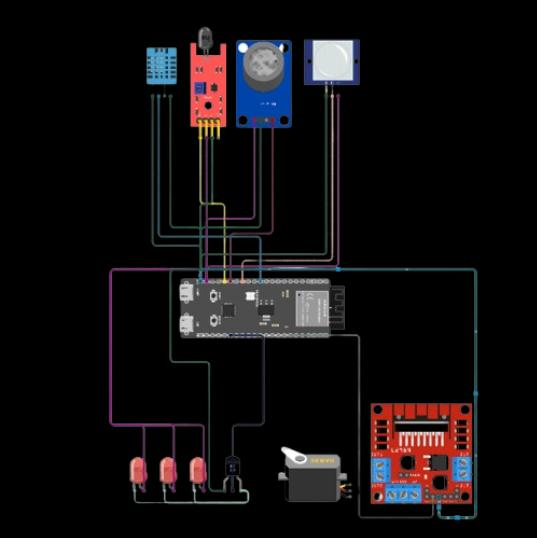
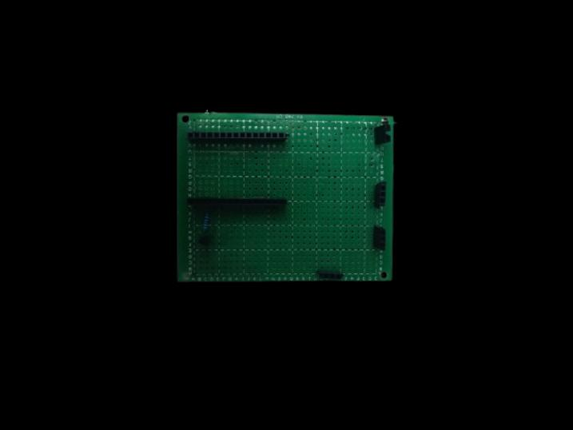

# BEITI TECK AI Smart Home

ESP32-based AI smart home system with face recognition, IoT monitoring, and safety alerts.

## Features

- **Face Recognition Door** — ESP32-CAM detects & recognizes faces, auto-opens door for known residents, alerts via Telegram for strangers
- **IoT Dashboard** — Blynk app for real-time monitoring and control
- **Environmental Monitoring** — Temperature (DHT11), humidity, gas leak, and fire detection
- **Smart Lighting** — PIR motion-activated outdoor light with manual override
- **Auto Fan Control** — Temperature-based fan speed (auto/manual modes)
- **Safety Alerts** — Buzzer triggers on gas leak or fire
- **ESP-NOW** — Wireless communication between camera and main ESP32 units

## Gallery

| House Architecture | Prototype / Solution |
|:-:|:-:|
|  |  |

## Hardware

| Component | Role |
|-----------|------|
| ESP32 (Main) | Central control, Blynk, sensors, servo |
| ESP32-CAM | Face detection/recognition, camera capture |
| DHT11 | Temp & humidity |
| HC-SR501 PIR | Motion detection |
| MQ-2 Gas Sensor | Gas leak detection |
| Flame Sensor | Fire detection |
| SG90 Servo | Door lock mechanism |
| Buzzer | Safety alerts |

## Getting Started

1. Install the required libraries in Arduino IDE
2. Copy `credentials.example.h` (create from code) and fill in your WiFi, Blynk, and Telegram credentials
3. Flash `smart_home_system/smart_home_system.ino` to the main ESP32
4. Flash `esp32_cam_pir_capture/esp32_cam_pir_capture.ino` to the ESP32-CAM
5. Power on — the system connects to WiFi and Blynk automatically

## Project Structure

```
├── esp32_cam_pir_capture/   — ESP32-CAM firmware (face rec, Telegram alerts)
├── smart_home_system/
│   ├── smart_home_system.ino — Main ESP32 firmware (Blynk, sensors, servo)
│   ├── esp32_cam_mac/        — Utility to get ESP32-CAM MAC address
│   └── esp32_mac/            — Utility to get main ESP32 MAC address
├── poster.pptx               — Project poster
└── team 15 poster.pdf        — Project poster (PDF)
```

## Built With

- Arduino framework for ESP32
- Blynk IoT platform
- ESP-NOW wireless protocol
- ESP-DL (Espressif's Deep Learning Library) for face recognition
- Telegram Bot API
